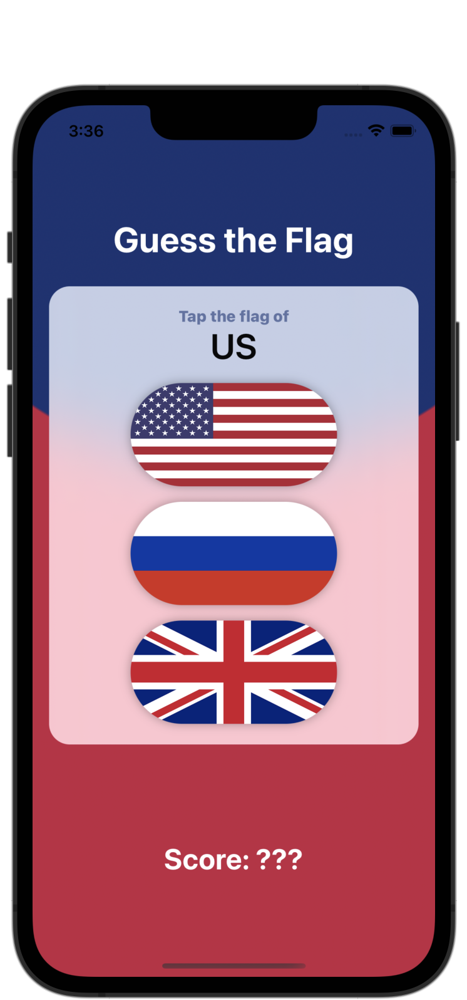
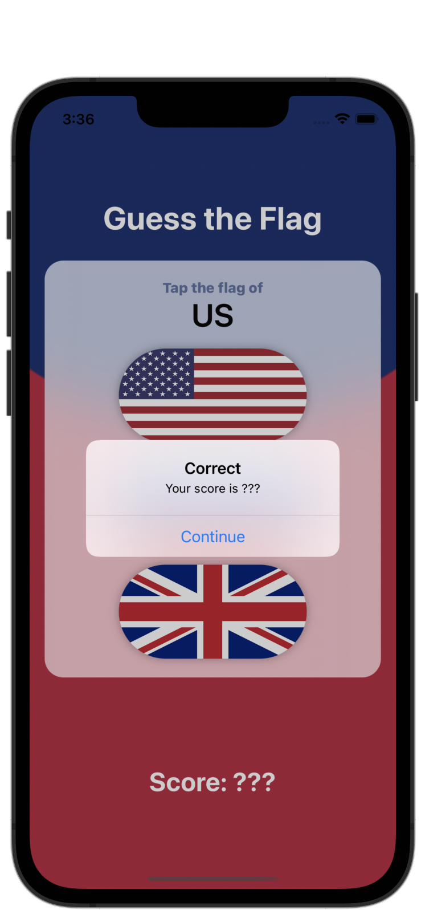
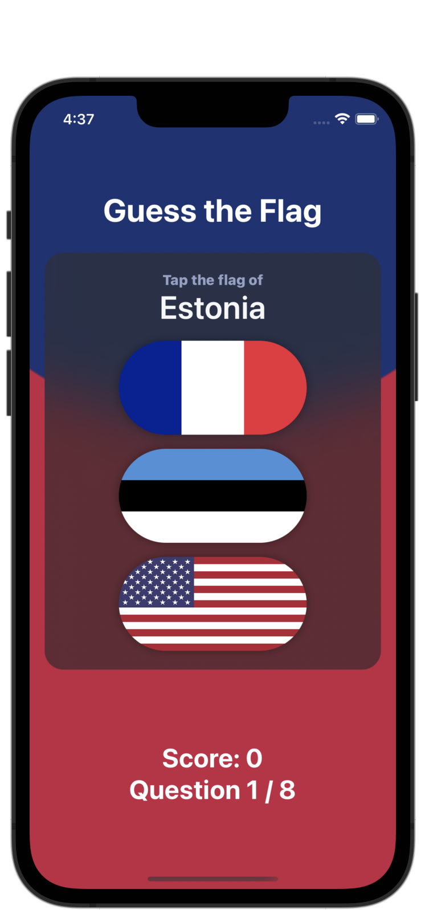
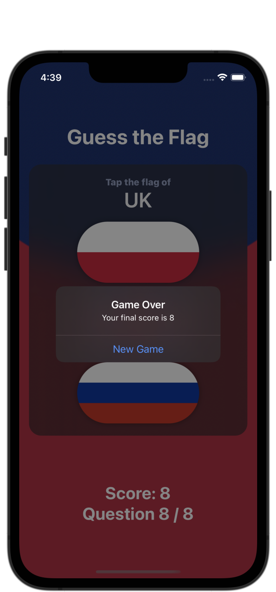

#  Project 2 - Guess the Flag

[Day 20 - Guess the Flag Overview](https://www.hackingwithswift.com/100/swiftui/20)

[Day 21 - Guess the Flag Implementation](https://www.hackingwithswift.com/100/swiftui/21)

[Day 22 - Guess the Flag Wrap Up and Review](https://www.hackingwithswift.com/100/swiftui/22)

## Topics

* VStack, HStack, ZStack
* Using stacks to arrange views
* Colors and frames
* LinearGradient, RadialGradient, AngularGradient
* Buttons and images
* Showing alert messages

## Challenges (Day 24/Project 3)

1. Add an @State property to store the user’s score, modify it when they get an answer right or wrong, then display it in the alert and in the score label.
2. When someone chooses the wrong flag, tell them their mistake in your alert message – something like “Wrong! That’s the flag of France,” for example.
3. Make the game show only 8 questions, at which point they see a final alert judging their score and can restart the game.

## Challenges (Day 34/Project 6)

1. When you tap a flag, make it spin around 360 degrees on the Y axis.
2. Make the other two buttons fade out to 25% opacity.
3. Add a third effect of your choosing to the two flags the user didn’t choose – maybe make them scale down? Or flip in a different direction? Experiment!
I made it so that all three flags would spin around 360 degrees on the X axis when a new turn begins.

## Screenshots

### Base app

    
    

### Challenges (Day 24/Project 3)

    
    
    

